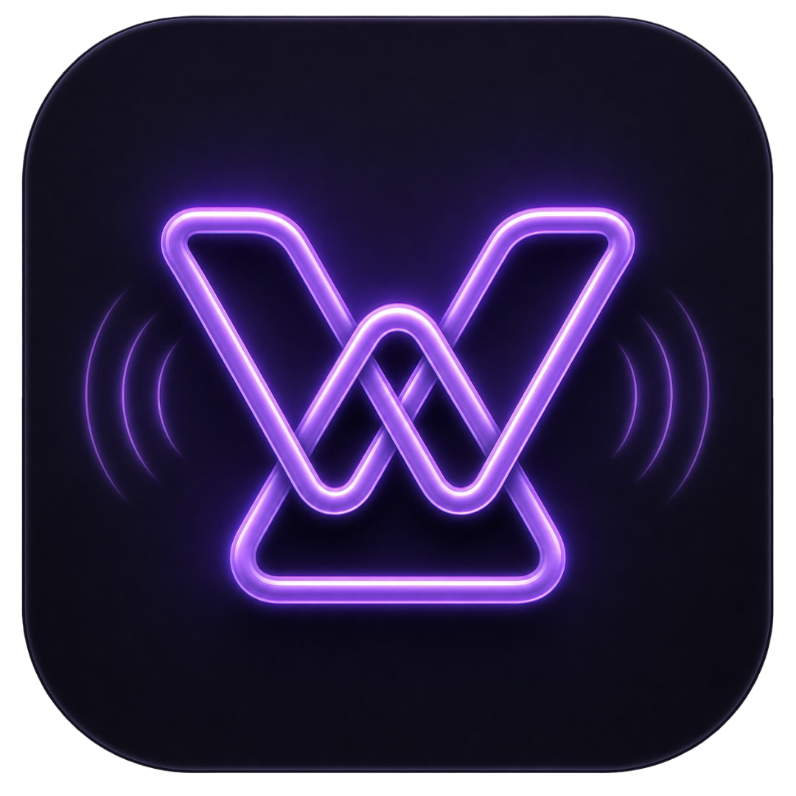
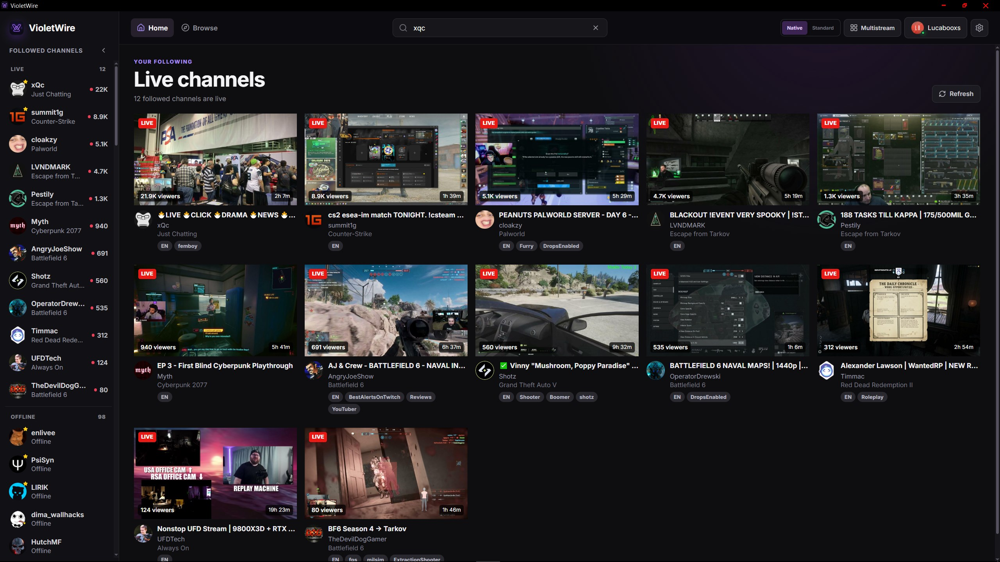
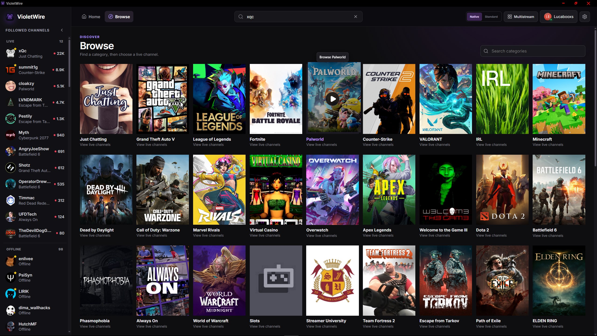
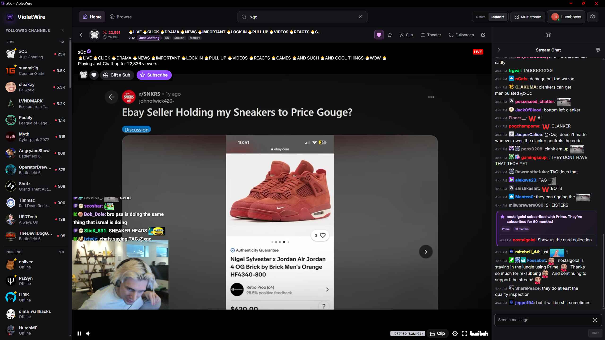
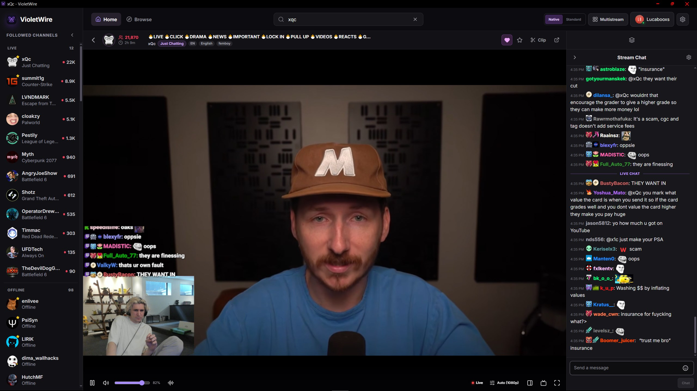
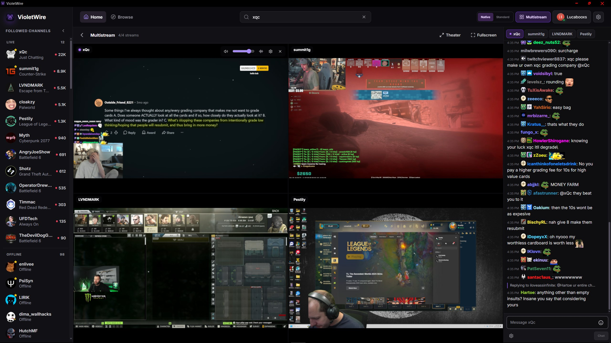

<p align="center">
  
</p>

<h1 align="center">VioletWire</h1>

<p align="center">
  A native-feeling Twitch and Kick viewer for Windows with official and experimental native playback, plus multistream.
</p>

<p align="center">
  <a href="https://violetwire.lucaboox.win">violetwire.lucaboox.win</a>
</p>

<p align="center">
  <a href="https://github.com/lucaboox/VioletWire/releases"></a>
  <a href="https://github.com/lucaboox/VioletWire/actions/workflows/release.yml"></a>
  
  
</p>

<p align="center">
  <a href="https://ko-fi.com/W7W3D7V7U"></a>
</p>

> [!IMPORTANT]
> VioletWire is alpha software. Core playback and chat work, but Twitch,
> Streamlink, and third-party emote APIs can change without notice.

## What is VioletWire?

VioletWire is an Electron, React, and TypeScript client for **Twitch and
Kick.com**, designed to feel like a focused Windows application instead of a
generic browser wrapper. Public streams on either service can be watched without
signing in. Signing in unlocks followed channels, account-aware chat, following,
subscription status, and other authenticated data — through Twitch's OAuth and,
separately, a Kick sign-in.

VioletWire is an independent project and is not affiliated with, endorsed by, or
sponsored by Twitch, Kick, 7TV, Streamlink, or mpv.

## Screenshots

<table>
  <tr>
    <td width="50%">
      <strong>Followed live channels</strong><br />
      <a href="docs/screenshots/home.jpg">
        
      </a>
    </td>
    <td width="50%">
      <strong>Browse categories</strong><br />
      <a href="docs/screenshots/browse.jpg">
        
      </a>
    </td>
  </tr>
  <tr>
    <td width="50%">
      <strong>Standard Twitch player</strong><br />
      <a href="docs/screenshots/standard-player.jpg">
        
      </a>
    </td>
    <td width="50%">
      <strong>Experimental Native player</strong><br />
      <a href="docs/screenshots/native-player.jpg">
        
      </a>
    </td>
  </tr>
  <tr>
    <td colspan="2">
      <strong>Multistream</strong><br />
      <a href="docs/screenshots/multistream.jpg">
        
      </a>
    </td>
  </tr>
</table>

## Features

### Two services

- Watch **Twitch and Kick** channels side by side in one app
- Followed lists from both services, filtered to Twitch, Kick, or both, with each avatar ringed by its service colour
- Kick chat, followed channels, sign-in, following, and native/7TV emotes, alongside the full Twitch feature set

### Browse and discover

- Followed channels separated into live and offline groups, with offline ones dimmed
- Favorite channels, set from a right-click menu, marked with a star and pinned to the top of their group
- Live channel cards with thumbnails, titles, categories, viewers, and uptime
- Browse popular categories on Twitch or Kick, highest-viewer-first, and open one to view its live streams
- A dedicated search page for channels and categories across Twitch and Kick, with an independent service scope
- Type `twitch:` or `kick:` in the search box to jump straight to a channel on that service
- Collapse the followed-channels sidebar to icons
- Infinite pagination with loading and error states

### Playback

- Twitch's official player for maximum website compatibility
- Experimental Streamlink + mpv Native player, which also plays Kick streams
- Automatic and manual quality selection
- Source quality when Twitch exposes it
- Volume, mute, pause, fullscreen, theater mode, and picture-in-picture where available
- Volume remembered between streams and across sessions
- Go-live state and low-latency-oriented native playback
- Optional dynamic audio compression
- Floating mini player that keeps a stream playing while you browse, draggable and resizable
- Create Twitch clips from the player controls
- Resizable side chat and a movable, resizable chat overlay
- Controls that hide automatically, with a configurable one-to-ten-second delay

### Multistream

- Watch up to four Native streams at once in a grid that adapts to the tile count
- Audio focus so only the tile you pick plays sound; click another tile to move it
- Per-tile mute, volume, audio compressor, and quality
- Theater mode and fullscreen that hide the app chrome so the grid fills the window
- Mix Twitch and Kick streams in the same grid, each tile labelled with its service
- Tabbed Stream Chat with every tile's chat connected at once (Twitch or Kick), so switching tabs is instant

### Chat and emotes

- Native Twitch and Kick chat, reading and sending
- Twitch badges, colors, emotes, replies, subscription notices, moderation events, and deleted messages
- Kick chat with history on connect, its native emotes and badges (moderator, verified, VIP, sub gifter, subscriber tiers), and follower/subscriber chat restrictions
- Clickable reply threads that keep their conversation context
- Clickable usernames with an in-app profile card and that user's recent messages
- Username and emote autocomplete
- Mention highlighting with an optional notification sound and a choice of four alert tones
- 7TV global and channel emotes on both Twitch and Kick
- FrankerFaceZ and BetterTTV global and channel emotes on Twitch
- Channel-aware Twitch emote picker with favorites and resizing
- Searchable Twitch, 7TV, FrankerFaceZ, and BetterTTV emote groups
- Rich emote tooltips with provider attribution
- Hover cards for Twitch clip links, YouTube links, and image links
- Configurable timestamps and recent-message history
- Pause autoscroll while reading older messages
- Bounded message history to prevent unbounded memory growth
- Safe text rendering without arbitrary chat HTML

### Account and privacy

- Official Twitch Device Code OAuth flow
- Separate Kick sign-in in its own isolated session, for following and account-aware Kick chat
- Follow and subscribe on either service — subscribing opens the channel's real subscribe page in an in-app modal
- Minimum-purpose Twitch scopes
- Tokens encrypted using Electron `safeStorage` and Windows DPAPI
- Separate, optional Twitch website playback session
- Complete sign-out and credential removal
- No Twitch passwords, copied browser cookies, or hardcoded personal tokens

### Windows experience

- Windows 11-inspired dark interface
- OLED true-black mode
- High-DPI and multi-monitor support
- Keyboard controls
- In-app changelog viewer
- NSIS installer
- GitHub Releases automatic updates

## Installation

Download the newest installer from
[GitHub Releases](https://github.com/lucaboox/VioletWire/releases), or from
[violetwire.lucaboox.win](https://violetwire.lucaboox.win).

The alpha installer is currently unsigned, so Windows SmartScreen may show an
unknown-publisher warning. Code signing is planned before a wider release.

## Native player

The Windows installer includes pinned, checksum-verified Streamlink and mpv
runtimes, so the experimental Native player works without installing anything
else. Custom developer builds can still be supplied with:

```text
VIOLETWIRE_STREAMLINK_PATH=C:\path\to\streamlink.exe
VIOLETWIRE_MPV_PATH=C:\path\to\mpv.exe
```

Environment overrides take priority over the bundled runtime. Without an
override, VioletWire prefers its bundled copies and then falls back to `PATH`
and common system installation locations.

## Twitch sign-in

VioletWire uses Twitch's official public Device Code flow. A Client Secret is not
stored or required.

Requested scopes:

- `user:read:follows`
- `user:read:subscriptions`
- `clips:edit`
- `user:read:chat`
- `user:write:chat`

Follow and subscription purchases still open Twitch-controlled pages because
Twitch does not provide public APIs for those mutations.

## Development

Requirements:

- Windows 10 or Windows 11
- Node.js 22+
- npm

```powershell
git clone https://github.com/lucaboox/VioletWire.git
cd VioletWire
npm install
npm run dev
```

Verification:

```powershell
npm run typecheck
npm run lint
npm test
npm run build
```

Build the Windows installer:

```powershell
npm run package:win
```

Artifacts are written to `release/`.

## Automatic updates

Installed GitHub release builds check for updates shortly after launch and every
six hours afterward. Updates download in the background and prompt before
restarting. Development builds and local installers without a configured release
feed do not contact an update server.

Pushing a version tag such as `v0.1.0-alpha.1` runs the Windows release workflow.
The tag must match the version in `package.json`.

## Third-party software and attribution

VioletWire redistributes and invokes Streamlink and mpv as separate executables
when the Native player is selected.

- Streamlink is licensed under the
  [BSD 2-Clause License](https://github.com/streamlink/streamlink/blob/master/LICENSE).
- mpv licensing depends on how a particular build was configured; official
  details are in mpv's
  [Copyright and licensing documentation](https://github.com/mpv-player/mpv/blob/master/Copyright).

See [THIRD_PARTY_NOTICES.md](THIRD_PARTY_NOTICES.md) and
[native runtime source information](third_party/NATIVE_RUNTIME_SOURCES.md) for
the licenses, exact versions, checksums, build definitions, and corresponding
source locations.

## Project license

Copyright (C) 2026 lucaboox and VioletWire contributors.

VioletWire-authored source code is free software licensed under the
[GNU General Public License v3.0 or later](LICENSE). If you distribute a
modified version of VioletWire, the GPL requires you to provide its
corresponding source code under the same license.

Bundled third-party software, provider marks, and adapted assets are not
relicensed under the GPL. They remain subject to their respective licenses and
notices described in [THIRD_PARTY_NOTICES.md](THIRD_PARTY_NOTICES.md) and
[native runtime source information](third_party/NATIVE_RUNTIME_SOURCES.md).
