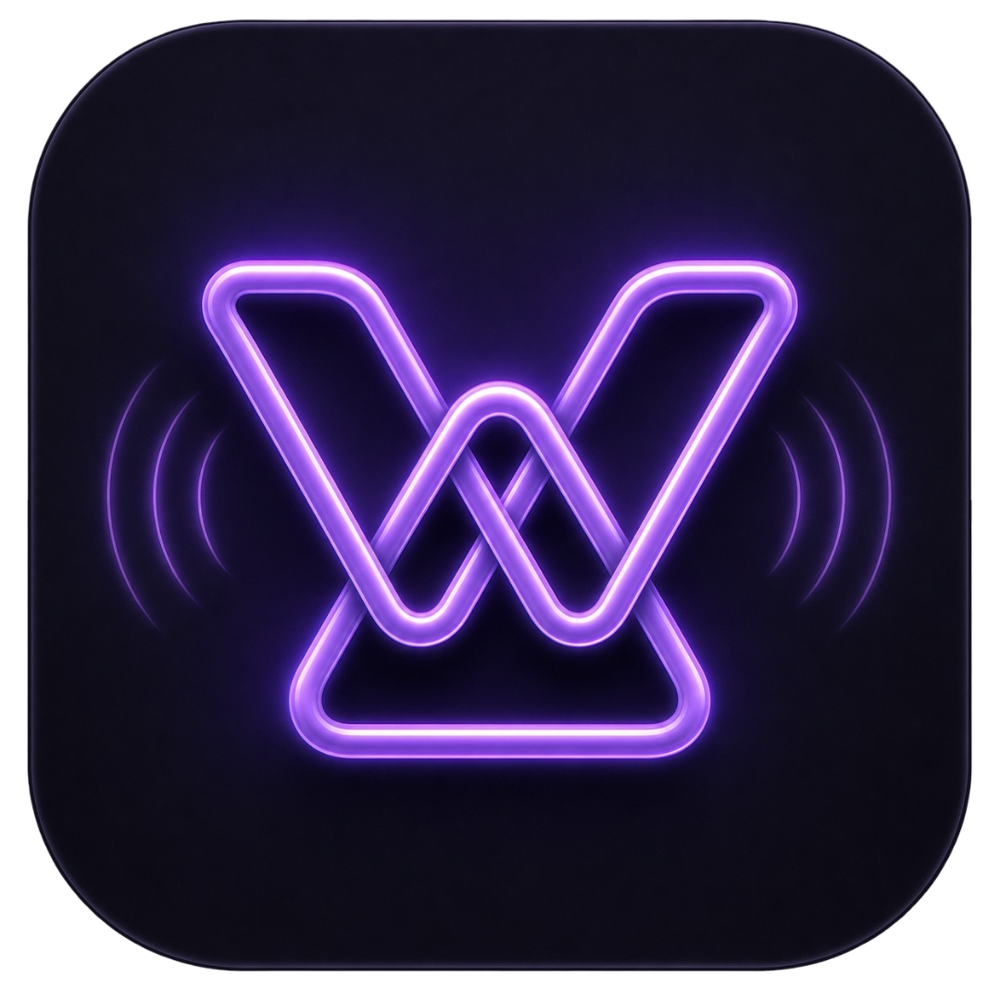
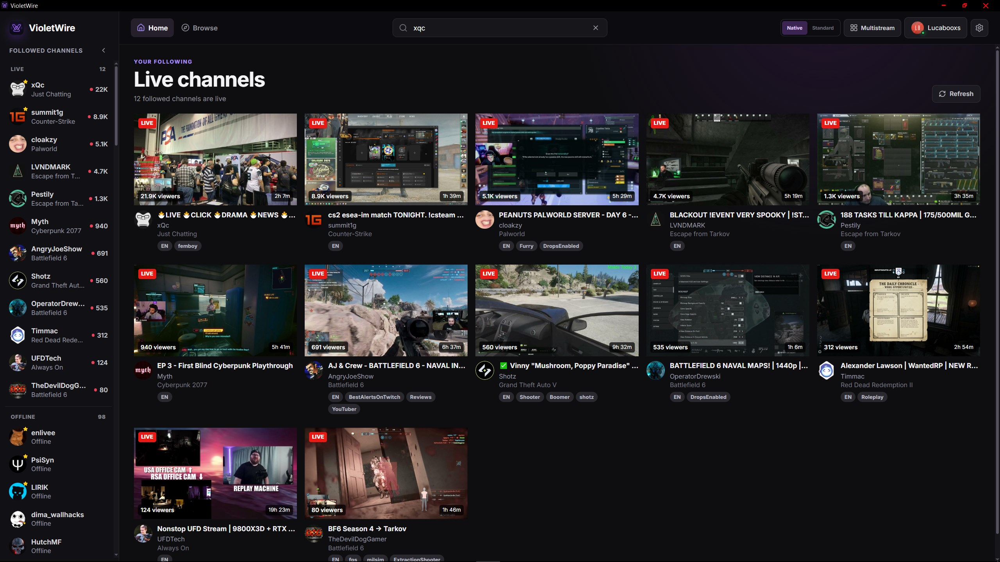
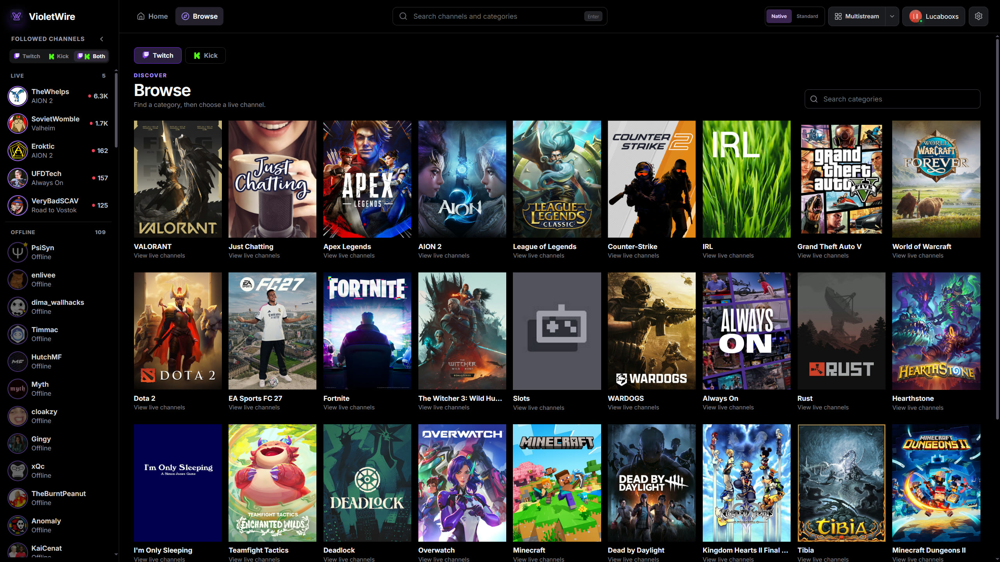
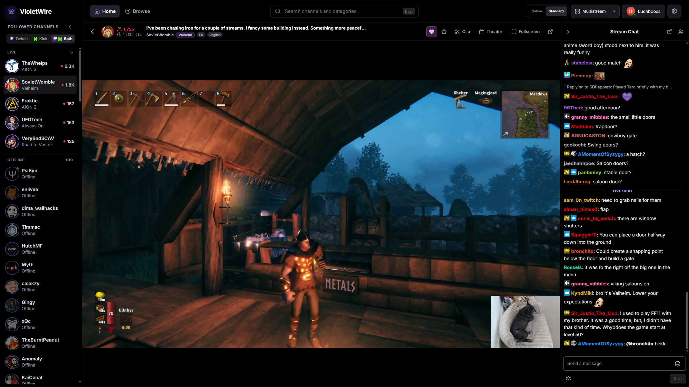
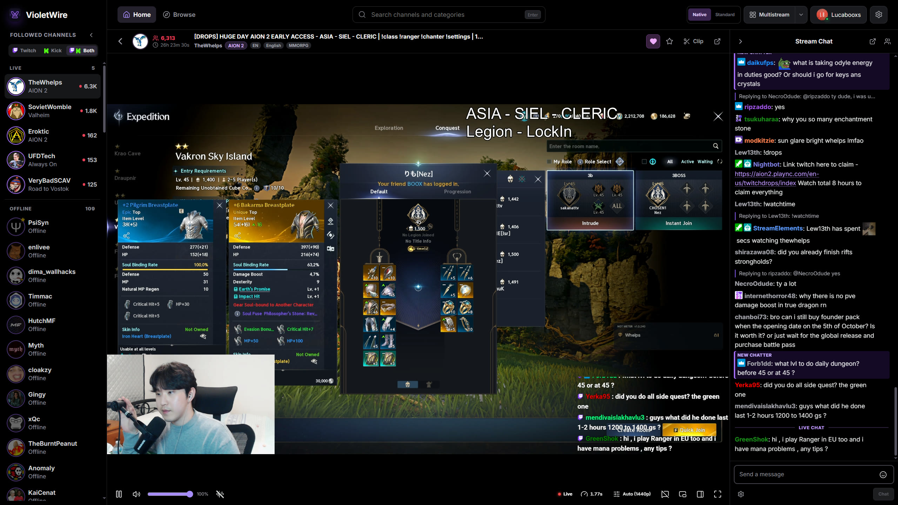
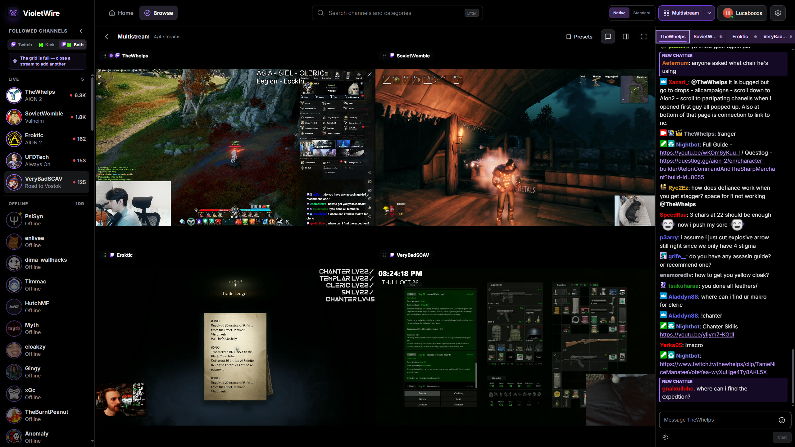

<p align="center">
  
</p>

<h1 align="center">VioletWire</h1>

<p align="center">
  Watch Twitch and Kick on Windows: low-latency playback, up to four streams at once, and chat with the emotes you actually use.
</p>

<p align="center">
  <a href="https://violetwire.lucaboox.win">violetwire.lucaboox.win</a>
</p>

<p align="center">
  <a href="https://github.com/lucaboox/VioletWire/releases"></a>
  <a href="https://github.com/lucaboox/VioletWire/actions/workflows/release.yml"></a>
  
  
</p>

<p align="center">
  <a href="https://ko-fi.com/W7W3D7V7U"></a>
</p>

> [!IMPORTANT]
> VioletWire is alpha software. Core playback and chat work, but Twitch,
> Streamlink, and third-party emote APIs can change without notice.

## What is VioletWire?

VioletWire is a desktop app for watching **Twitch and Kick** on Windows, built to
feel like a real Windows app rather than a website in a window. Public streams
work without an account; sign in to either service, or both, to get your
followed channels and chat.

VioletWire is an independent project and is not affiliated with, endorsed by, or
sponsored by Twitch, Kick, 7TV, FrankerFaceZ, BetterTTV, or Streamlink.

## Screenshots

<table>
  <tr>
    <td width="50%">
      <strong>Followed live channels</strong><br />
      <a href="docs/screenshots/home.jpg">
        
      </a>
    </td>
    <td width="50%">
      <strong>Browse categories</strong><br />
      <a href="docs/screenshots/browse.jpg">
        
      </a>
    </td>
  </tr>
  <tr>
    <td width="50%">
      <strong>Standard Twitch player</strong><br />
      <a href="docs/screenshots/standard-player.jpg">
        
      </a>
    </td>
    <td width="50%">
      <strong>VioletWire Native player</strong><br />
      <a href="docs/screenshots/native-player.jpg">
        
      </a>
    </td>
  </tr>
  <tr>
    <td colspan="2">
      <strong>Multistream</strong><br />
      <a href="docs/screenshots/multistream.jpg">
        
      </a>
    </td>
  </tr>
</table>

## Features

### Watching

- **Low latency.** The Native player runs about three seconds behind the
  broadcaster, level with or a little ahead of Twitch's own player, and plays
  Kick too. Twitch's own player is one setting away.
- Any quality up to Source, plus theater mode, fullscreen, picture-in-picture,
  and a mini player that keeps playing while you browse.
- Clip a Twitch stream from the player, keep your volume between streams, and
  turn on an audio compressor for loud streams.

### Multistream

- Up to four streams in one grid, Twitch and Kick mixed.
- Sound comes from the tile you pick, and each tile has its own volume and
  quality.
- Drag tiles to rearrange them, and save a line-up as a preset to open from the
  top bar.
- One chat panel with a tab per stream; tabs show when there are new messages
  or someone mentions you.

### Chat

- Read and send on Twitch and Kick, with badges, replies, and moderation events.
- 7TV, FrankerFaceZ, BetterTTV, and each service's own emotes, in a searchable
  picker with favorites.
- Name and emote autocomplete, profile cards with a user's recent messages, and
  previews for clips, YouTube, and image links.
- Mentions are highlighted, with a choice of alert sounds.

### Finding streams

- Followed channels from both services in one sidebar, live first, with
  favorites pinned to the top.
- Browse categories and search channels on either service. Type `twitch:name`
  or `kick:name` to jump straight to a channel.

### Account and privacy

- Twitch's official sign-in, so you never type your password into VioletWire,
  and a separate Kick sign-in. Tokens are encrypted by Windows.
- Follow and subscribe on either service without leaving the app.
- There is no VioletWire server or account. The app talks directly to Twitch,
  Kick, the emote providers, a few public community services (chat history and
  link previews), and GitHub for updates.
- Signing out removes the stored credentials.

### A real Windows app

- A dark Windows 11-style interface, with an optional true-black OLED mode.
- Keyboard shortcuts throughout; press `?` to see them all.
- Automatic updates from GitHub that ask before restarting, and an in-app
  changelog.

## Installation

Download the newest installer from
[GitHub Releases](https://github.com/lucaboox/VioletWire/releases), or from
[violetwire.lucaboox.win](https://violetwire.lucaboox.win).

The alpha installer is currently unsigned, so Windows SmartScreen may show an
unknown-publisher warning. Code signing is planned before a wider release.

## Native player

The installer includes everything the Native player needs, including a pinned,
checksum-verified copy of Streamlink. To use your own Streamlink instead (for
development, say), set:

```text
VIOLETWIRE_STREAMLINK_PATH=C:\path\to\streamlink.exe
```

Without it, VioletWire uses its bundled copy, then `PATH`, then the usual
install locations.

## Twitch sign-in

VioletWire uses Twitch's official Device Code sign-in, so it never sees your
password and needs no client secret. It asks for:

- **Follows, subscriptions, and emotes:** `user:read:follows`,
  `user:read:subscriptions`, `user:read:emotes`
- **Chat:** `user:read:chat`, `user:write:chat`, `user:manage:chat_color`
- **Clips:** `clips:edit`
- **Moderation**, for moderation tools still being built, and only ever in
  channels you moderate: `user:read:moderated_channels`,
  `moderator:manage:banned_users`, `moderator:manage:chat_messages`,
  `moderator:manage:announcements`, `moderator:manage:chat_settings`,
  `moderator:manage:warnings`, `moderator:manage:shield_mode`

Following a channel and buying a subscription open Twitch's own pages, since
Twitch has no public API for either.

## Development

Requirements:

- Windows 10 or Windows 11
- Node.js 22+
- npm

```powershell
git clone https://github.com/lucaboox/VioletWire.git
cd VioletWire
npm install
npm run dev
```

Verification:

```powershell
npm run typecheck
npm run lint
npm test
npm run build
```

Build the Windows installer:

```powershell
npm run package:win
```

Artifacts are written to `release/`.

## Automatic updates

Installed builds check GitHub for updates shortly after launch and every six
hours. Updates download in the background and ask before restarting. Development
builds never contact an update server.

Pushing a version tag such as `v0.1.0-alpha.1` runs the Windows release
workflow; the tag must match the version in `package.json`.

## Third-party software and attribution

VioletWire redistributes and invokes Streamlink as a separate executable when
the Native player is selected. Chromium and hls.js render the resolved stream.

- Streamlink is licensed under the
  [BSD 2-Clause License](https://github.com/streamlink/streamlink/blob/master/LICENSE).
See [THIRD_PARTY_NOTICES.md](THIRD_PARTY_NOTICES.md) and
[bundled Streamlink source information](third_party/NATIVE_RUNTIME_SOURCES.md) for
the licenses, exact versions, checksums, build definitions, and corresponding
source locations.

## Project license

Copyright (C) 2026 lucaboox and VioletWire contributors.

VioletWire-authored source code is free software licensed under the
[GNU General Public License v3.0 or later](LICENSE). If you distribute a
modified version of VioletWire, the GPL requires you to provide its
corresponding source code under the same license.

Bundled third-party software, provider marks, and adapted assets are not
relicensed under the GPL. They remain subject to their respective licenses and
notices described in [THIRD_PARTY_NOTICES.md](THIRD_PARTY_NOTICES.md) and
[bundled Streamlink source information](third_party/NATIVE_RUNTIME_SOURCES.md).
